# Architecture Diagram: Unified Projection

```mermaid
graph TB
    subgraph "Current State (Dual Authority)"
        A1[Source Code] --> B1[SemanticProgram]
        B1 --> C1[ArchitectureTransformer]
        C1 --> D1[ArchitectureGraph]
        C1 --> E1[ArtifactManifest]
        
        B1 --> F1[DomainModel]
        F1 --> G1[ArchitectureModel?]
        G1 --> H1[Adapter]
        H1 --> D1
    end
    
    subgraph "Target State (Single Authority)"
        A2[Source Code] --> B2[SemanticProgram]
        B2 --> C2[DomainModel]
        C2 --> D2[DecisionSet]
        D2 --> E2[ArchitectureModel]
        E2 --> F2[ArtifactManifest]
        
        C2 --> G2[CanonicalProjection]
        D2 --> G2
        G2 --> E2
        G2 --> F2
    end
    
    subgraph "Semantic Levels"
        L1[Source IR] --> L2[Semantic IR]
        L2 --> L3[Domain Model]
        L3 --> L4[Decision Set]
        L4 --> L5[Architecture Model]
        L5 --> L6[Artifact Manifest]
    end
    
    style C1 fill:#f96,stroke:#333
    style G1 fill:#f96,stroke:#333
    style H1 fill:#f96,stroke:#333
    
    style G2 fill:#9f9,stroke:#333
    style E2 fill:#9f9,stroke:#333
    style F2 fill:#9f9,stroke:#333
```



## Key Components

### Domain Model (Level 3)
- `DomainNode`: Business entities, value objects, aggregates
- `DomainRelation`: Business relationships
- `BusinessInvariant`: Domain rules and constraints

### Architecture Model (Level 5)
- `Module`: Deployment units
- `Component`: Architectural components (services, ports, adapters)
- `Relation`: Technical relationships

### Artifact Manifest (Level 6)
- `Artifact`: Generated files with metadata
- `manifestHash`: Content-addressed hash for preview/apply sharing

## Data Flow

```
Source Code
    ↓
SemanticProgram (parsed)
    ↓
DomainModel (business concepts)
    ↓
DecisionSet (architectural choices)
    ↓
ArchitectureModel (technical structure)
    ↓
ArtifactManifest (file layout)
    ↓
Generated Code
```

## Invariants

1. **Single Projection**: One path from DomainModel + DecisionSet → ArchitectureModel + ArtifactManifest
2. **Content Addressing**: manifestHash uniquely identifies a manifest
3. **No Back References**: Data flows forward only
4. **Deterministic IDs**: Same input → same IDs
5. **Stable Ordering**: Collections sorted by ID
