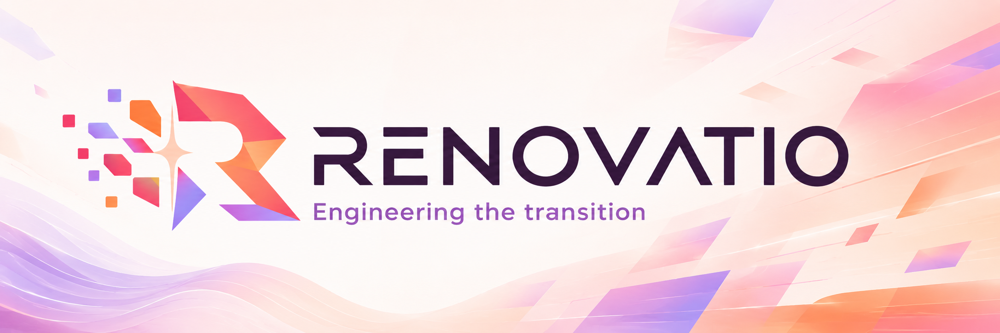
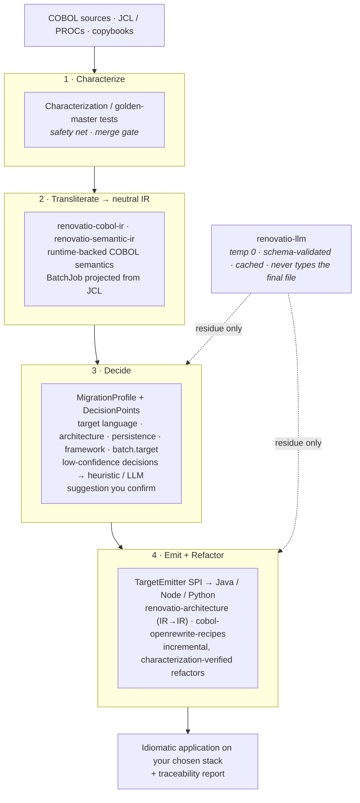
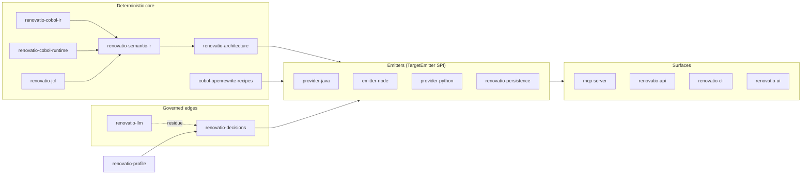

<p align="center">
  
</p>

# Renovatio — the decision‑driven mainframe modernization engine

**Renovatio turns a COBOL/JCL codebase into a maintainable, idiomatic application on the
stack *you* choose — without betting the business on a black box.**

Legacy modernization projects fail for two reasons: the automated tools produce
unreadable "Jabol" that nobody can own, and the manual rewrites take years and drift
from the original behavior. Renovatio is built to avoid both. Every transformation is
**deterministic, reproducible and auditable**; an LLM is used only on the residual ~20%
that genuinely needs judgment, and it is never allowed to type the final file.

You drive the migration by **decisions** — target language, architecture, persistence,
framework — and Renovatio reduces the COBOL‑to‑modern impedance one decision at a time,
recording the evidence for each one.

---

## Why Renovatio

| Pain in a typical migration | How Renovatio answers it |
|---|---|
| Auto‑translated code is unreadable and unmaintainable | Deterministic transliteration through a neutral semantic IR, then **verified** OpenRewrite refactors toward idiomatic OOP/hexagonal code |
| "Big bang" rewrites are unverifiable | **Characterization / golden‑master harness is a merge gate** — generated behavior is pinned before any refactor |
| One tool = one target language and one architecture | **Decision engine**: pick Java, Node or Python; transaction‑script, layered‑MVC or hexagonal; pluggable persistence — defaults reproduce current behavior byte‑for‑byte |
| LLMs hallucinate and can't be audited | LLM runs at temperature 0, schema‑validated, content‑addressed cache committed to the repo, every call recorded as governed evidence. Deterministic fallback always present |
| The JCL that runs everything in production is lost | `renovatio-jcl` parses JCL (steps, `COND`, datasets, utilities) and emits a real orchestration (Spring Batch first) |
| No traceability from old to new | Semantic diff maps every COBOL paragraph to its target use‑case/method; every decision is stored and attributable |
| Modernization work itself is ungoverned | Built and shipped under **Agora** spec‑driven governance: spec → plan → implementation → verification, Test‑First, per‑phase acceptance criteria |

---

## How it works



**LLM only on the residue** — naming (`VAR-CLI-NUM-POL` → `policyNumber`), Javadoc/intent
docs, GOTO/control‑flow structuring plans, `REDEFINES` intent, semantic diff. Pass A
enriches the IR offline; Pass B deterministic recipes consume it; Pass C optional polish
gated by characterization tests + human review.

---

## Capabilities today

- **COBOL → Java** — parsing, metrics, migration plans, copybook and embedded‑DB2/EXEC‑SQL
  code generation, OpenRewrite‑based modernization pipeline.
- **COBOL → Node and COBOL → Python** — via the `TargetEmitter` SPI (`renovatio-emitter-node`,
  `renovatio-provider-python`); Prisma persistence strategy and idiom catalog for Node.
- **Architecture transform** — neutral IR→IR transformation into canonical transaction‑script
  or hexagonal Java layouts, with a UI preview of the target architecture.
- **Pluggable persistence** — `PersistenceStrategy` SPI (JPA, Prisma, …) chosen per migration.
- **JCL batch orchestration** — `renovatio-jcl`: `JclParser` → `BatchJob` IR → `SpringBatchBatchEmitter`;
  `COND`/`IF‑THEN‑ELSE` compiled to an auditable condition graph; `SORT`/`IEBGENER`/`IDCAMS`
  utility templates; unsupported steps become explicit manual action items, never silent gaps.
- **Governed LLM layer** — `renovatio-llm`: versioned `PromptCatalog`, `PromptOutputValidator`
  + JSON schema, three‑hash deterministic cache, decisions recorded in `renovatio-decisions`.
- **MCP server** — all of the above exposed as MCP tools over JSON‑RPC 2.0 for VS Code,
  Copilot Workspace and other MCP clients, with per‑language tool filtering.

---

## Architecture

Renovatio is a multi‑module Maven project (Java 21) with a strict separation between the
deterministic semantic core and everything that could introduce non‑determinism.



```
renovatio/
├── renovatio-shared/           # Common DTOs, SPI interfaces, NQL grammar
├── renovatio-cobol-ir/         # COBOL Intermediate Representation
├── renovatio-cobol-runtime/    # Zero‑dep runtime encapsulating COBOL semantics (PicType, decimals, EBCDIC)
├── renovatio-semantic-ir/      # Target‑neutral semantic IR (SemanticProgram, BatchJob)
├── renovatio-jcl/              # JCL parser → BatchJob projection → batch emitter SPI
├── renovatio-profile/          # MigrationProfile + effective‑profile resolution
├── renovatio-decisions/        # Decision points, decision records, suggestion service
├── renovatio-architecture/     # Neutral IR→IR architecture transformation
├── renovatio-persistence/      # PersistenceStrategy SPI (JPA, Prisma, …)
├── renovatio-llm/              # Governed LLM: prompt catalog, validation, deterministic cache
├── renovatio-emitter-node/     # Node/TypeScript TargetEmitter
├── renovatio-provider-python/  # Python provider / emitter
├── renovatio-provider-java/    # Java provider (OpenRewrite integration)
├── renovatio-provider-cobol/   # COBOL provider (parsing, metrics, migration)
├── cobol-openrewrite-recipes/  # OpenRewrite recipes for post‑generation refactoring
├── renovatio-core/             # Protocol‑agnostic orchestration and tool registry
├── renovatio-api/              # REST API
├── renovatio-cli/              # Command‑line entrypoint
├── renovatio-ui/               # Migration UI (target/decisions steps, architecture & semantic diff previews)
└── renovatio-mcp-server/       # MCP protocol server (JSON‑RPC 2.0)
```

See **[ARCHITECTURE.md](./ARCHITECTURE.md)** for design principles and the per‑module READMEs
linked in the Documentation Index below.

---

## Quick Start

```bash
# 1. Build (Java 21+, Maven)
mvn clean install

# 2. Run the MCP server (HTTP mode)
java -jar renovatio-mcp-server/target/renovatio-mcp-server-*.jar

# 3. Or stdio mode, for direct MCP clients
java -cp renovatio-mcp-server/target/renovatio-mcp-server-*.jar \
     org.shark.renovatio.mcp.server.McpStdioServerApplication
```

Connect an MCP client (VS Code extension, Copilot Workspace, …) to access the migration
tools. A sample `vscode-mcp-config.json` is included; pre‑configured setups live in
[`examples/`](./examples/). Full walkthrough: **[MCP-CLIENT-GUIDE.md](./MCP-CLIENT-GUIDE.md)**.

### Language selection

Clients can request tools for one language by passing a `language` parameter on
`initialize` or `tools/list` (`"java"` or `"cobol"`); omit it to get every provider's tools.

---

## Available MCP Tools

### Java provider

`java.discover` · `java.analyze` · `java.plan` · `java.apply` · `java.diff` · `java.review` ·
`java.format` · `java.test` · `java.metrics` · `java.recipe_list` · `java.recipe_describe` ·
`java.pipeline`

Plus dynamic recipe tools: every OpenRewrite recipe discovered on the classpath or in
`rewrite.yml` is exposed as `java.<recipeId>`.

### COBOL provider

`cobol.analyze` · `cobol.metrics` · `cobol.plan` · `cobol.apply` · `cobol.diff` ·
`cobol.migrate_copybook` · `cobol.migrate_db2`

All provider tools accept a `workspacePath` parameter (added automatically by the server
adapter when absent). Tool names are also exposed in underscore form (`java_analyze`) for
clients that don't support dots; both forms are understood.

---

## Roadmap

Renovatio is being built out under Epic **[#152 — decision‑parameterized migration engine](https://github.com/Modern-Ash/renovatio/issues/152)**.
Each phase is one governed Agora cycle with its own spec, plan and acceptance criteria.

| Phase | Scope | Status |
|---|---|---|
| F0 | Decision‑model cartography spike (`docs/specs/decision-model-cartography.md`) | ✅ done |
| F1 | `renovatio-profile` + `renovatio-decisions` + `DecisionSuggestionService` + Target/Decisions UI | ✅ done |
| F2 | `renovatio-semantic-ir` + `TargetEmitter` SPI | ✅ done |
| F3 | `renovatio-architecture` IR→IR (transaction‑script / hexagonal) | ✅ done |
| F4 | Pluggable `PersistenceStrategy` SPI | ✅ done |
| F5 | Node / Python emitter + Prisma strategy | ✅ done |
| F6 | Residual LLM: naming, docs, control‑flow plans, semantic diff | ✅ done |
| **F7** | **[`renovatio-jcl`](https://github.com/Modern-Ash/renovatio/issues/153) — batch orchestration (JCL steps, `COND`, datasets, utilities)** | ✅ delivered, in review |
| **F8** | **[Reusable decision profiles & policy catalog](https://github.com/Modern-Ash/renovatio/issues/154)** — templates shared across projects | 🔜 open |

**Invariants held across every phase:** defaults reproduce current behavior byte‑for‑byte;
the characterization harness is the merge gate for anything on the COBOL→target path;
the LLM never types the final file.

---

## Design principles

1. **Deterministic core, governed edges.** The semantic IR and OpenRewrite recipes are
   pure and reproducible. Non‑determinism is quarantined in `renovatio-llm` behind schema
   validation and a committed cache.
2. **Verify before you refactor.** Characterization tests pin behavior first; refactors are
   applied incrementally and re‑verified.
3. **Ports emerge, they are not imposed.** Hexagonal boundaries come from the call graph and
   data ownership; start as a modular monolith.
4. **Every decision is evidence.** Target, architecture, persistence and per‑identifier
   choices are stored, attributable and reviewable.
5. **No silent gaps.** Anything Renovatio can't translate deterministically becomes an
   explicit manual action item.

---

## 📖 Documentation Index

### Getting started
- **[MCP-QUICK-REFERENCE.md](./MCP-QUICK-REFERENCE.md)** — quick reference for common tasks
- **[MCP-CLIENT-GUIDE.md](./MCP-CLIENT-GUIDE.md)** — full MCP client guide (language filtering, examples, troubleshooting)
- **[examples/](./examples/)** — pre‑configured client setups

### Architecture & design
- **[ARCHITECTURE.md](./ARCHITECTURE.md)** — system architecture and design principles
- **[docs/specs/INDEX.md](./docs/specs/INDEX.md)** — technical specifications index
- Decision engine specs: [decision-model-cartography](./docs/specs/decision-model-cartography.md) ·
  [f1-decision-layer](./docs/specs/f1-decision-layer.md) ·
  [f2-semantic-ir-emitter-spi](./docs/specs/f2-semantic-ir-emitter-spi.md) ·
  [f3-architecture-transform](./docs/specs/f3-architecture-transform.md) ·
  [f4-persistence-strategy](./docs/specs/f4-persistence-strategy.md) ·
  [f5-node-emitter](./docs/specs/f5-node-emitter.md) ·
  [f6-residual-llm](./docs/specs/f6-residual-llm.md) ·
  [f7-renovatio-jcl](./docs/specs/f7-renovatio-jcl.md)
- **[schemas/](./schemas/)** — JSON schemas for configuration validation

### Module READMEs
- [renovatio-shared](./renovatio-shared/README.md) — shared DTOs, SPI interfaces, NQL grammar
- [renovatio-core](./renovatio-core/README.md) — core MCP engine, tool catalog, NQL routing
- [renovatio-provider-java](./renovatio-provider-java/README.md) — Java provider (OpenRewrite)
- [renovatio-provider-cobol](./renovatio-provider-cobol/README.md) — COBOL provider (parsing, metrics, migration)
- [renovatio-cobol-ir](./renovatio-cobol-ir/README.md) — COBOL Intermediate Representation
- [cobol-openrewrite-recipes](./cobol-openrewrite-recipes/README.md) — post‑generation refactoring recipes
- [renovatio-mcp-server](./renovatio-mcp-server/README.md) — Spring Boot MCP server

### COBOL → Python
- **[docs/COBOL-TO-PYTHON-README.md](./docs/COBOL-TO-PYTHON-README.md)** — documentation index
- **[docs/RESUMEN-EJECUTIVO-COBOL-PYTHON.md](./docs/RESUMEN-EJECUTIVO-COBOL-PYTHON.md)** — executive summary (Spanish)
- **[docs/COBOL-TO-PYTHON-TECHNICAL-SPEC.md](./docs/COBOL-TO-PYTHON-TECHNICAL-SPEC.md)** — technical spec

### Spec‑driven development & governance
- **[docs/SPEC_DRIVEN_DEVELOPMENT.md](./docs/SPEC_DRIVEN_DEVELOPMENT.md)** — SDD in Renovatio (Java/Spring Boot/Maven)
- **[.specify/memory/constitution.md](./.specify/memory/constitution.md)** — SDD principles and governance

### Brand
- **[docs/assets/README.md](./docs/assets/README.md)** — 🎨 logos, icons, banner, palette, usage rules

---

## Configuration (OpenRewrite)

Renovatio loads OpenRewrite configuration from a top‑level `rewrite.yml` if present. The
Java provider discovers recipes from the runtime classpath and from `rewrite.yml` and
exposes each as an MCP tool.

```yaml
rewrite:
  recipes:
    - org.openrewrite.java.format.AutoFormat
    - org.openrewrite.java.cleanup.RemoveUnusedImports
```

---

## Technology stack

Java 21 · Spring Boot · Maven · OpenRewrite · Lombok · MCP (Model Content Protocol) ·
JSON‑RPC 2.0 · Spring Batch (JCL target) · Prisma (Node persistence)

**Lombok:** enable annotation processing in your IDE (IntelliJ: Settings → Build,
Execution, Deployment → Compiler → Annotation Processors). Modules using Lombok declare
`requires static lombok;` in `module-info.java`. Prefer Lombok annotations for new POJOs.

---

## Contributing

- Code and documentation are in English (identifiers, comments, README, Javadoc).
- Code reviews and review suggestions from maintainers may be in Spanish for convenience.
- Follow conventional commit messages; keep modules self‑contained.
- **Test‑First is non‑negotiable** (JUnit 5, `*Test.java`, `mvn test`). New work goes
  through an Agora governed cycle — see the constitution.
- Issues: **[GitHub Issues](https://github.com/Modern-Ash/renovatio/issues)**

---

**Renovatio** — engineering the transition from mainframe to modern, one auditable decision at a time.

<sub>A  project · <a href="https://github.com/Modern-Ash">github.com/Modern-Ash</a></sub>
