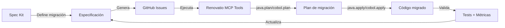

# ¿Qué es @github/spec-kit y cómo puede mejorar Renovatio?

## 📋 Índice

1. [¿Qué es @github/spec-kit?](#1-qué-es-githubspec-kit)
2. [Características principales](#2-características-principales)
3. [¿Cómo puede mejorar Renovatio?](#3-cómo-puede-mejorar-renovatio)
4. [Beneficios específicos para Renovatio](#4-beneficios-específicos-para-renovatio)
5. [Propuestas de mejora concretas](#5-propuestas-de-mejora-concretas)
6. [Plan de implementación](#6-plan-de-implementación)
7. [Recursos y referencias](#7-recursos-y-referencias)

---

## 1. ¿Qué es @github/spec-kit?

**GitHub Spec Kit** es un conjunto de herramientas, plantillas y flujos de trabajo diseñado por GitHub para **estandarizar la creación y gestión de especificaciones técnicas y funcionales** en proyectos de software.

### Componentes principales

- **📝 Plantillas estructuradas**: Formatos predefinidos para documentar especificaciones de forma consistente
- **🔧 CLI (Command Line Interface)**: Herramientas para generar, validar y sincronizar especificaciones
- **🔄 Integración con GitHub**: Sincronización automática con Issues, Projects y Pull Requests
- **✅ Validación automatizada**: Verificación de completitud y consistencia de las especificaciones
- **📊 Seguimiento**: Métricas y estados de progreso integrados

### Filosofía de diseño

Spec Kit promueve un enfoque **iterativo y trazable** para la documentación técnica:

```
Borrador → Revisión → Aprobación → Ejecución → Validación → Cierre
```

Cada fase está respaldada por metadatos estructurados que facilitan la automatización y la integración con herramientas de gestión de proyectos.

---

## 2. Características principales

### 2.1 Especificaciones versionadas

- Las specs se almacenan como archivos Markdown en el repositorio
- Control de versiones completo mediante Git
- Historial de cambios y revisiones trazable

### 2.2 Metadatos estructurados

Cada especificación incluye metadatos YAML/JSON con:

```yaml
---
title: "Migración de copybooks COBOL a entidades JPA"
status: "draft" | "in-review" | "approved" | "in-progress" | "completed"
version: "1.0.0"
author: "equipo-modernización"
reviewers: ["arquitecto-senior", "tech-lead"]
priority: "high" | "medium" | "low"
labels: ["cobol", "migration", "jpa", "db2"]
linked_issues: [123, 456]
target_modules: ["renovatio-provider-cobol", "renovatio-core"]
---
```

### 2.3 CLI para automatización

```bash
# Crear una nueva especificación
spec-kit init --template renovatio-spec-template.md

# Validar una especificación
spec-kit validate spec/migration-db2.md

# Sincronizar con GitHub Issues
spec-kit sync --create-issues spec/migration-db2.md

# Actualizar estado
spec-kit update --status in-progress spec/migration-db2.md

# Generar reporte de progreso
spec-kit report --format markdown
```

### 2.4 Integración con GitHub Projects

- Creación automática de issues desde secciones de la spec
- Sincronización bidireccional de estados
- Generación de tableros Kanban vinculados a specs
- Métricas de progreso en tiempo real

### 2.5 Plantillas personalizables

Las plantillas definen la estructura de las especificaciones y pueden adaptarse a las necesidades del proyecto:

```markdown
## 1. Contexto y problema
## 2. Objetivos y métricas
## 3. Alcance técnico
## 4. Diseño y arquitectura
## 5. Plan de implementación
## 6. Validación y pruebas
## 7. Riesgos y mitigación
## 8. Checklist de ejecución
```

---

## 3. ¿Cómo puede mejorar Renovatio?

### 3.1 Mejora en la planificación de migraciones

Actualmente, Renovatio tiene un flujo de trabajo potente para **ejecutar** migraciones, pero la **planificación y documentación** de estas migraciones podría beneficiarse de Spec Kit:

**Estado actual:**
- Las migraciones se planifican mediante herramientas MCP (`java.plan`, `cobol.plan`)
- La documentación está dispersa en varios archivos Markdown
- No hay un proceso estándar para documentar iniciativas complejas

**Con Spec Kit:**
- Cada iniciativa de migración tiene una especificación formal
- Trazabilidad completa desde el concepto hasta la ejecución
- Integración directa con las herramientas MCP de Renovatio

### 3.2 Estandarización de la documentación técnica

**Problema actual:**
- Varios formatos de documentación (README, ARCHITECTURE, guías específicas)
- Falta de consistencia en la profundidad y estructura
- Difícil seguimiento de cambios arquitectónicos importantes

**Solución con Spec Kit:**
- Plantilla estándar para todos los cambios arquitectónicos
- Metadatos estructurados para búsqueda y filtrado
- Historial de decisiones técnicas trazable

### 3.3 Integración con el ecosistema MCP

Renovatio es un servidor MCP que expone herramientas de refactorización. Spec Kit puede complementar esto:



### 3.4 Automatización del flujo de trabajo

Combinando Spec Kit con GitHub Actions y Renovatio MCP:

1. **Spec Kit** documenta la migración
2. **GitHub Actions** dispara workflows automáticos
3. **Renovatio MCP** ejecuta las herramientas de migración
4. **Spec Kit** actualiza el estado y genera reportes

---

## 4. Beneficios específicos para Renovatio

### 4.1 Para equipos de modernización

✅ **Claridad**: Cada proyecto de migración tiene una especificación clara y completa
✅ **Trazabilidad**: Desde la idea inicial hasta el código producido
✅ **Coordinación**: Múltiples equipos pueden trabajar en specs relacionadas
✅ **Validación**: Criterios de aceptación claros desde el principio

### 4.2 Para desarrolladores

✅ **Contexto completo**: Entienden por qué y cómo migrar código
✅ **Guía clara**: Pasos definidos y validaciones esperadas
✅ **Herramientas adecuadas**: Qué tools de Renovatio usar y con qué parámetros
✅ **Métricas**: Saben qué medir para validar el éxito

### 4.3 Para arquitectos y tech leads

✅ **Visión holística**: Todas las iniciativas en un solo lugar
✅ **Revisión estructurada**: Proceso formal de revisión técnica
✅ **Gestión de riesgos**: Identificación temprana de problemas
✅ **Decisiones documentadas**: Historial de decisiones arquitectónicas

### 4.4 Para la adopción de Renovatio

✅ **Mejores prácticas**: Biblioteca de specs exitosas como referencia
✅ **Onboarding**: Nuevos usuarios aprenden de especificaciones reales
✅ **Casos de uso**: Documentación práctica de escenarios reales
✅ **Comunidad**: Compartir y reutilizar especificaciones entre organizaciones

---

## 5. Propuestas de mejora concretas

### 5.1 Crear biblioteca de especificaciones de referencia

**Propuesta:** Mantener en `docs/specs/` una colección de especificaciones de ejemplo para casos de uso comunes:

```
docs/specs/
├── renovatio-spec-template.md          # Plantilla base (ya existe)
├── ejemplos/
│   ├── migracion-cobol-basica.md       # Migración COBOL → Java simple
│   ├── migracion-db2-jpa.md            # DB2 embebido → JPA
│   ├── modernizacion-java17.md         # Upgrade Java 8 → 17
│   ├── pipeline-ci-cd.md               # Integración con CI/CD
│   └── refactoring-openrewrite.md      # Refactoring con OpenRewrite
└── activas/
    ├── ...                              # Specs en progreso
    └── ...
```

**Beneficio:** Los usuarios pueden copiar y adaptar estas especificaciones para sus propios proyectos.

### 5.2 Integrar Spec Kit con herramientas MCP de Renovatio

**Propuesta:** Crear una nueva herramienta MCP que lea especificaciones y genere planes automáticamente:

```json
{
  "name": "renovatio.spec_to_plan",
  "description": "Genera un plan de migración desde una especificación Spec Kit",
  "inputSchema": {
    "type": "object",
    "properties": {
      "specPath": {
        "type": "string",
        "description": "Ruta a la especificación Spec Kit"
      },
      "language": {
        "type": "string",
        "enum": ["java", "cobol"],
        "description": "Lenguaje objetivo"
      }
    },
    "required": ["specPath", "language"]
  }
}
```

**Implementación:**
- Parser que lee el archivo Spec Kit Markdown
- Extrae secciones clave (objetivos, alcance, módulos)
- Genera llamadas a `java.plan` o `cobol.plan` con parámetros derivados de la spec
- Retorna un plan ejecutable

### 5.3 Automatizar la sincronización con GitHub Projects

**Propuesta:** Workflow de GitHub Actions que:

1. Detecta cambios en `docs/specs/`
2. Valida la especificación con `spec-kit validate`
3. Crea/actualiza issues en GitHub Projects
4. Ejecuta herramientas MCP de Renovatio cuando la spec está "approved"
5. Actualiza el estado de la spec con los resultados

```yaml
# .github/workflows/spec-kit-sync.yml
name: Spec Kit Sync

on:
  push:
    paths:
      - 'docs/specs/**/*.md'
  workflow_dispatch:

jobs:
  sync:
    runs-on: ubuntu-latest
    steps:
      - uses: actions/checkout@v4
      
      - name: Validate specs
        run: |
          npm install -g @github/spec-kit
          spec-kit validate docs/specs/activas/*.md
      
      - name: Sync with GitHub Issues
        run: |
          spec-kit sync --create-issues docs/specs/activas/*.md
        env:
          GITHUB_TOKEN: ${{ secrets.GITHUB_TOKEN }}
      
      - name: Execute approved specs with Renovatio
        if: contains(github.event.head_commit.message, '[execute-spec]')
        run: |
          # Detectar specs con status "approved"
          # Ejecutar renovatio MCP tools correspondientes
          # Actualizar spec con resultados
```

### 5.4 Enriquecer metadatos de las especificaciones

**Propuesta:** Añadir campos específicos de Renovatio a los metadatos de las specs:

```yaml
---
# Metadatos estándar de Spec Kit
title: "Migración de programa COBOL con DB2 a Java + JPA"
status: "approved"
version: "1.0.0"

# Metadatos específicos de Renovatio
renovatio:
  language: "cobol"
  target_language: "java"
  modules:
    - "renovatio-provider-cobol"
    - "renovatio-core"
  tools:
    - name: "cobol.analyze"
      params:
        workspacePath: "/path/to/cobol"
    - name: "cobol.plan"
      params:
        workspacePath: "/path/to/cobol"
        target: "migration"
    - name: "cobol.apply"
      params:
        planId: "${generated_plan_id}"
        dryRun: false
  expected_metrics:
    files_migrated: 10
    lines_of_code: 5000
    test_coverage: ">= 80%"
  validation_commands:
    - "mvn clean test"
    - "mvn verify"
---
```

**Beneficio:** La especificación se convierte en una receta ejecutable que puede ser procesada automáticamente.

### 5.5 Dashboard de especificaciones

**Propuesta:** Crear una página de documentación que muestre el estado de todas las especificaciones:

```markdown
# Dashboard de Especificaciones Renovatio

## En progreso (3)
- [Migración DB2 a JPA](docs/specs/activas/migracion-db2-jpa.md) - 60% completado
- [Modernización Java 17](docs/specs/activas/java17-upgrade.md) - 30% completado
- [Pipeline CI/CD](docs/specs/activas/pipeline-cicd.md) - 80% completado

## Aprobadas pendientes de ejecución (1)
- [Refactoring OpenRewrite](docs/specs/activas/refactoring-batch.md)

## Completadas (5)
- [Migración COBOL básica](docs/specs/completadas/cobol-basico.md) ✅
- ...

## Métricas
- **Total de especificaciones**: 9
- **Tasa de éxito**: 100%
- **Tiempo promedio**: 2 semanas
```

Esto puede generarse automáticamente con un script que parsee los metadatos de todas las specs.

### 5.6 Integración con herramientas de análisis

**Propuesta:** Añadir comandos que generen métricas desde especificaciones:

```bash
# Generar reporte de complejidad
spec-kit analyze docs/specs/activas/migracion-compleja.md

# Salida:
# Complejidad: Alta
# Módulos afectados: 4
# Dependencias externas: 2
# Riesgos identificados: 3
# Tiempo estimado: 3-4 semanas
# Recomendación: Dividir en 2 fases
```

### 5.7 Templates específicos por tipo de migración

**Propuesta:** Crear templates especializados:

```
docs/specs/templates/
├── renovatio-spec-template.md           # Template genérico (ya existe)
├── cobol-to-java-template.md            # Migración COBOL → Java
├── java-upgrade-template.md             # Upgrade de versión Java
├── db2-to-jpa-template.md               # DB2 embebido → JPA
├── batch-to-spring-batch-template.md    # JCL → Spring Batch
└── openrewrite-recipe-template.md       # Nueva receta OpenRewrite
```

Cada template incluiría secciones específicas para ese tipo de migración.

---

## 6. Plan de implementación

### Fase 1: Fundamentos (2 semanas)

- [x] Crear documento de explicación de Spec Kit (este documento)
- [ ] Instalar y configurar `@github/spec-kit` en el proyecto
- [ ] Actualizar `renovatio-spec-template.md` con metadatos enriquecidos
- [ ] Crear 2-3 especificaciones de ejemplo en `docs/specs/ejemplos/`
- [ ] Documentar el flujo de trabajo en `docs/spec-kit-integracion.md`

### Fase 2: Integración básica (2 semanas)

- [ ] Crear workflow de GitHub Actions para validación de specs
- [ ] Implementar sincronización básica con GitHub Issues
- [ ] Crear templates especializados para casos de uso comunes
- [ ] Añadir sección sobre Spec Kit al README principal

### Fase 3: Automatización avanzada (3 semanas)

- [ ] Implementar herramienta MCP `renovatio.spec_to_plan`
- [ ] Crear workflow para ejecución automática de specs aprobadas
- [ ] Desarrollar parser de metadatos enriquecidos de Renovatio
- [ ] Implementar dashboard de especificaciones

### Fase 4: Mejora continua (ongoing)

- [ ] Crear biblioteca de especificaciones de referencia
- [ ] Documentar casos de éxito y lecciones aprendidas
- [ ] Integrar métricas y reportes automáticos
- [ ] Compartir mejores prácticas con la comunidad

---

## 7. Recursos y referencias

### Documentación oficial

- [GitHub Spec Kit Repository](https://github.com/github/spec-kit) - Repositorio oficial de Spec Kit
- [Spec Kit Documentation](https://github.com/github/spec-kit#readme) - Documentación completa

### Documentación de Renovatio

- [README.md](../README.md) - Documentación principal del proyecto
- [ARCHITECTURE.md](../ARCHITECTURE.md) - Arquitectura del sistema
- [spec-kit-integracion.md](./spec-kit-integracion.md) - Guía de integración actual
- [renovatio-spec-template.md](./specs/renovatio-spec-template.md) - Plantilla de especificación

### Recursos relacionados

- [Model Content Protocol (MCP)](https://modelcontextprotocol.io/) - Especificación del protocolo MCP
- [OpenRewrite Documentation](https://docs.openrewrite.org/) - Documentación de OpenRewrite
- [agents.md](https://agents.md/) - Mejores prácticas para integración con agentes

### Casos de uso inspiradores

- **Modernización de aplicaciones legacy**: Especificaciones para guiar migraciones COBOL → Java
- **Refactorización incremental**: Specs que documentan mejoras iterativas
- **Automatización de CI/CD**: Integración de specs con pipelines de despliegue
- **Gestión de deuda técnica**: Priorización y seguimiento de mejoras técnicas

---

## Conclusión

**GitHub Spec Kit** puede mejorar significativamente Renovatio al proporcionar:

1. **Estructura** para planificar y documentar migraciones complejas
2. **Trazabilidad** desde el concepto hasta la ejecución
3. **Automatización** mediante integración con MCP tools y GitHub Actions
4. **Estandarización** de procesos y mejores prácticas
5. **Colaboración** entre equipos mediante especificaciones compartidas

La integración de Spec Kit con las capacidades MCP de Renovatio crea un flujo de trabajo completo: desde la especificación de una migración hasta su ejecución automatizada, validación y documentación de resultados.

Este enfoque no solo mejora la calidad y trazabilidad de las migraciones, sino que también facilita la adopción de Renovatio al proporcionar guías claras y reutilizables para casos de uso comunes.

---

**Próximos pasos recomendados:**

1. Revisar y aprobar este documento
2. Iniciar Fase 1 del plan de implementación
3. Crear primera especificación piloto para una migración real
4. Iterar y mejorar basándose en feedback del equipo

¿Preguntas? Consulta la [guía de integración](./spec-kit-integracion.md) o abre un issue en el repositorio.
