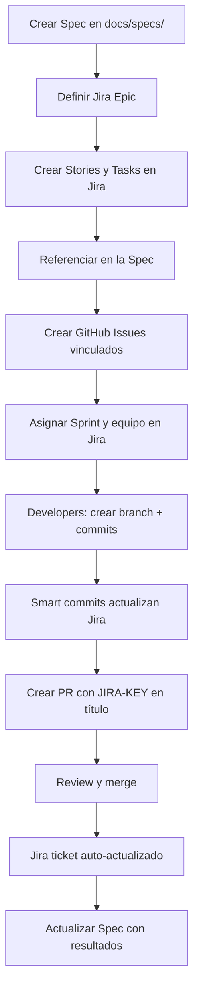

# Integración Jira-GitHub en Renovatio Spec-Driven Workflow

> **Guía completa para usar tickets de Jira en las secciones de planning y tasks de las especificaciones Spec-Kit**

## 📋 Tabla de Contenidos

1. [Resumen](#resumen)
2. [Configuración Inicial](#configuración-inicial)
3. [Uso de Jira en Especificaciones](#uso-de-jira-en-especificaciones)
4. [Smart Commits y Automatización](#smart-commits-y-automatización)
5. [Workflows y Best Practices](#workflows-y-best-practices)
6. [Ejemplos Prácticos](#ejemplos-prácticos)
7. [Troubleshooting](#troubleshooting)

---

## Resumen

**¿Puedo referenciar y usar tickets Jira en spec-driven.md?**

**✅ SÍ, absolutamente.** El repositorio Renovatio ya cuenta con las aplicaciones de Jira y GitHub instaladas, lo que permite una integración completa entre ambas plataformas. Esta guía explica cómo aprovechar Jira en tus especificaciones siguiendo el modelo @github/spec-kit/files/spec-driven.md.

### Beneficios de la integración

- **Trazabilidad completa**: Cada tarea de la spec vinculada a un ticket Jira
- **Sincronización bidireccional**: Cambios en Jira se reflejan en GitHub y viceversa
- **Workflow automatizado**: Transiciones de estado automáticas con smart commits
- **Métricas unificadas**: Seguimiento de progreso en ambas plataformas
- **Gestión centralizada**: Planning en Jira, ejecución en GitHub

---

## Configuración Inicial

### 1. Verificar la instalación de GitHub-Jira App

La app ya está instalada en el repositorio. Para verificar:

1. Ve a tu repositorio en GitHub
2. Navega a **Settings** > **Integrations** > **GitHub Apps**
3. Verifica que "Jira" o "Jira Cloud" esté instalado y activo

### 2. Configurar la conexión en Jira

En tu instancia de Jira:

1. Ve a **Apps** > **Manage Apps**
2. Busca "GitHub for Jira"
3. Configura el workspace para el repositorio `accentureshark/renovatio`
4. Otorga los permisos necesarios (read issues, write comments, etc.)

### 3. Configurar proyecto Jira

Crea o configura un proyecto Jira para Renovatio:

- **Key sugerido**: `RENO` (Renovatio)
- **Tipo**: Software (Scrum o Kanban)
- **Issue types**: Epic, Story, Task, Sub-task, Bug

### 4. Variables de entorno (opcional)

Para automatización avanzada, configura en GitHub Actions:

```yaml
env:
  JIRA_BASE_URL: "https://your-company.atlassian.net"
  JIRA_PROJECT_KEY: "RENO"
  JIRA_API_TOKEN: ${{ secrets.JIRA_API_TOKEN }}
  JIRA_USER_EMAIL: ${{ secrets.JIRA_USER_EMAIL }}
```

---

## Uso de Jira en Especificaciones

### Estructura recomendada en spec-driven.md

```markdown
---
# Metadatos de la especificación
title: "Migración de copybooks COBOL a JPA"
status: "in-progress"
jira_epic: "RENO-100"
jira_parent_story: "RENO-101"
linked_jira_issues: ["RENO-102", "RENO-103", "RENO-104"]
linked_github_issues: [45, 46, 47]
---

# Migración de copybooks COBOL a JPA

> **Jira Epic**: [RENO-100](https://your-company.atlassian.net/browse/RENO-100)  
> **GitHub Issue**: #45

## 1. Resumen ejecutivo

### Contexto
[Descripción del problema]

**Jira Story**: [RENO-101 - Análisis de copybooks](https://your-company.atlassian.net/browse/RENO-101)

## 4. Diseño y plan de ejecución

### Tareas planificadas (Jira Integration)

| Tarea | Jira Ticket | Asignado | Estado | Sprint | Estimación |
|-------|-------------|----------|--------|--------|------------|
| Análisis de copybooks | [RENO-102](https://jira/RENO-102) | @juan-dev | Done | Sprint 1 | 3 SP |
| Parser COBOL | [RENO-103](https://jira/RENO-103) | @maria-dev | In Progress | Sprint 1 | 5 SP |
| Generador JPA | [RENO-104](https://jira/RENO-104) | @carlos-dev | To Do | Sprint 2 | 8 SP |
| Tests integración | [RENO-105](https://jira/RENO-105) | @ana-qa | To Do | Sprint 2 | 3 SP |

### Detalle de tareas

#### Tarea 1: Análisis de copybooks
- **Jira**: [RENO-102](https://your-company.atlassian.net/browse/RENO-102)
- **GitHub PR**: #123 (en revisión)
- **Descripción**: Analizar estructura de copybooks existentes
- **Dependencias**: Ninguna
- **Criterios de aceptación**: Definidos en RENO-102

#### Tarea 2: Parser COBOL
- **Jira**: [RENO-103](https://your-company.atlassian.net/browse/RENO-103)
- **GitHub PR**: #124 (draft)
- **Descripción**: Implementar parser para copybooks
- **Dependencias**: RENO-102
- **Criterios de aceptación**: Definidos en RENO-103

## 7. Checklist de implementación

### Planning & Tracking (Jira)
- [x] Jira Epic creada: [RENO-100](https://jira/RENO-100)
- [x] Story principal: [RENO-101](https://jira/RENO-101)
- [x] Sub-tareas creadas: RENO-102 a RENO-105
- [x] Sprint asignado (Sprint 1 & 2)
- [ ] Story points estimados y validados
- [ ] Dependencias configuradas en Jira

### Implementación (GitHub)
- [x] GitHub issues creados: #45, #46, #47
- [ ] PRs enlazados con Jira: usar formato "RENO-XXX: título"
- [ ] Smart commits habilitados
- [ ] CI/CD configurado

### Sincronización
- [x] GitHub-Jira app activa
- [x] Webhooks configurados
- [ ] Estados mapeados correctamente
- [ ] Transiciones automáticas validadas
```

### Campos Jira en metadatos YAML

Añade estos campos en el frontmatter de tu spec:

```yaml
---
title: "Nombre de la especificación"
status: "draft" | "in-review" | "approved" | "in-progress" | "completed"

# Campos Jira
jira_epic: "RENO-100"                       # Epic principal
jira_parent_story: "RENO-101"               # Story padre
linked_jira_issues: ["RENO-102", "RENO-103"] # Lista de tareas Jira
jira_project: "RENO"                        # Key del proyecto Jira
jira_sprint: "Sprint 1"                     # Sprint actual
jira_labels: ["migration", "cobol", "jpa"] # Labels Jira

# Campos GitHub (sincronizados)
linked_github_issues: [45, 46, 47]          # Issues GitHub
github_milestone: "v1.2.0"                  # Milestone GitHub

# Integración
sync_enabled: true                          # Habilitar sincronización auto
---
```

---

## Smart Commits y Automatización

### ¿Qué son los Smart Commits?

Smart Commits permiten ejecutar acciones en Jira directamente desde commits de Git. Formato:

```
<ISSUE_KEY> #<COMMAND> <OPTIONAL_COMMENT>
```

### Comandos disponibles

#### 1. Comentar en un ticket

```bash
git commit -m "RENO-102 #comment Implementado el parser de copybooks"
```

Resultado en Jira: Añade un comentario al ticket RENO-102.

#### 2. Registrar tiempo

```bash
git commit -m "RENO-103 #time 3h Trabajado en generador JPA"
```

Resultado en Jira: Registra 3 horas de trabajo en RENO-103.

#### 3. Cambiar estado

```bash
git commit -m "RENO-104 #close Tarea completada y validada"
```

Resultado en Jira: Mueve RENO-104 a estado "Done" o "Closed".

Otros estados:
```bash
RENO-105 #start           # Mover a "In Progress"
RENO-106 #progress        # Mover a "In Progress"
RENO-107 #done            # Mover a "Done"
RENO-108 #resolve         # Resolver el ticket
```

#### 4. Comandos combinados

```bash
git commit -m "RENO-102 #time 2h #comment Parser implementado #close"
```

Resultado: Registra tiempo, añade comentario Y cierra el ticket.

### Ejemplo de workflow completo

```bash
# 1. Iniciar trabajo en una tarea
git checkout -b feature/RENO-102-copybook-parser
git commit -m "RENO-102 #start Iniciando desarrollo del parser"

# 2. Commits de progreso
git commit -m "RENO-102 #comment Implementada primera versión del parser"
git commit -m "RENO-102 #time 1h30m Refactorización del código"

# 3. Finalizar y crear PR
git commit -m "RENO-102 #comment Parser completado, listo para revisión"
git push origin feature/RENO-102-copybook-parser

# 4. Título del PR (en GitHub)
# "RENO-102: Implementar parser de copybooks COBOL"
# El formato "RENO-XXX:" en el título vincula automáticamente el PR a Jira

# 5. Al mergear el PR, cerrar el ticket
git commit -m "RENO-102 #close Parser integrado y validado"
```

### Sincronización automática con GitHub Actions

Crea `.github/workflows/jira-sync.yml`:

```yaml
name: Jira Sync

on:
  pull_request:
    types: [opened, edited, closed]
  issues:
    types: [opened, edited, closed]
  push:
    branches:
      - main

jobs:
  sync-jira:
    runs-on: ubuntu-latest
    steps:
      - name: Checkout
        uses: actions/checkout@v4

      - name: Jira Login
        uses: atlassian/gajira-login@v3
        env:
          JIRA_BASE_URL: ${{ secrets.JIRA_BASE_URL }}
          JIRA_USER_EMAIL: ${{ secrets.JIRA_USER_EMAIL }}
          JIRA_API_TOKEN: ${{ secrets.JIRA_API_TOKEN }}

      - name: Update Jira ticket
        uses: atlassian/gajira-transition@v3
        with:
          issue: ${{ github.event.issue.title }}
          transition: "In Progress"

      - name: Add comment to Jira
        uses: atlassian/gajira-comment@v3
        with:
          issue: ${{ github.event.issue.title }}
          comment: |
            GitHub Action: PR merged
            PR: ${{ github.event.pull_request.html_url }}
            Commit: ${{ github.sha }}
```

---

## Workflows y Best Practices

### Workflow recomendado: Spec → Jira → GitHub → Ejecución



### 1. Planning en Jira

**Epic:**
- Título: Mismo que la spec
- Descripción: Link a la spec en GitHub
- Labels: Los mismos que en la spec

**Stories:**
- Una por módulo principal o fase
- Link a secciones específicas de la spec

**Tasks/Sub-tasks:**
- Una por cada tarea del plan de ejecución
- Estimación en story points
- Criterios de aceptación claros

### 2. Naming conventions

**Jira:**
- Epic: `RENO-XXX: [Spec Title]`
- Story: `RENO-XXX: [Module/Phase] - [Brief description]`
- Task: `RENO-XXX: [Specific task]`

**GitHub:**
- Branch: `feature/RENO-XXX-description` o `fix/RENO-XXX-description`
- PR: `RENO-XXX: [Description]`
- Issue: `[RENO-XXX] [Description]` (opcional si ya está en Jira)

### 3. Mapeo de estados

| Estado Jira | Estado GitHub Issue | Acción |
|-------------|---------------------|--------|
| To Do | Open | Issue creado |
| In Progress | Open + label "in-progress" | Developer asignado |
| In Review | Open + linked PR | PR abierto |
| Done | Closed | PR mergeado |
| Blocked | Open + label "blocked" | Bloqueador identificado |

### 4. Best Practices

✅ **DO:**
- Siempre referenciar el Jira ticket en commits y PRs
- Mantener la spec actualizada con links a Jira
- Usar smart commits para automatizar actualizaciones
- Documentar dependencias entre tickets
- Estimar con story points en Jira
- Cerrar tickets cuando el PR se mergea

❌ **DON'T:**
- No crear duplicados (issue en Jira Y GitHub para lo mismo)
- No usar smart commits sin entender las transiciones
- No cerrar tickets sin verificar criterios de aceptación
- No olvidar actualizar la spec cuando cambien los planes

---

## Ejemplos Prácticos

### Ejemplo 1: Spec completa con Jira

Ver: [docs/specs/ejemplos/migracion-cobol-jira.md](./specs/ejemplos/migracion-cobol-jira.md)

### Ejemplo 2: Smart commits en acción

```bash
# Día 1: Comenzar tarea
git checkout -b feature/RENO-210-db2-parser
git commit -m "RENO-210 #start Iniciando parser DB2 embebido"

# Día 2: Progreso
git commit -m "RENO-210 #comment Implementados métodos base del parser"
git commit -m "RENO-210 #time 4h Desarrollo de parser"

# Día 3: Más progreso
git commit -m "RENO-210 #comment Añadidos tests unitarios" 
git commit -m "RENO-210 #time 3h Testing y refactoring"

# Día 4: Completar
git commit -m "RENO-210 #comment Parser DB2 completado, coverage 85%"
git push origin feature/RENO-210-db2-parser

# Crear PR en GitHub con título:
# "RENO-210: Implementar parser para DB2 embebido en COBOL"

# Al mergear:
git commit -m "RENO-210 #close Parser integrado exitosamente"
```

### Ejemplo 3: Tabla de tareas en spec

```markdown
## 4. Plan de ejecución

### Sprint 1: Análisis y diseño

| Tarea | Jira | Assignee | Points | Status |
|-------|------|----------|--------|--------|
| Análisis de requisitos | [RENO-200](https://jira/RENO-200) | @tech-lead | 2 | ✅ Done |
| Diseño de arquitectura | [RENO-201](https://jira/RENO-201) | @architect | 3 | ✅ Done |
| Setup de entorno | [RENO-202](https://jira/RENO-202) | @devops | 2 | ✅ Done |

### Sprint 2: Implementación Core

| Tarea | Jira | Assignee | Points | Status |
|-------|------|----------|--------|--------|
| Parser COBOL | [RENO-210](https://jira/RENO-210) | @dev1 | 5 | 🔄 In Progress |
| Generador Java | [RENO-211](https://jira/RENO-211) | @dev2 | 8 | 📋 To Do |
| Templates Freemarker | [RENO-212](https://jira/RENO-212) | @dev2 | 3 | 📋 To Do |

### Sprint 3: Testing y validación

| Tarea | Jira | Assignee | Points | Status |
|-------|------|----------|--------|--------|
| Tests unitarios | [RENO-220](https://jira/RENO-220) | @qa1 | 3 | 📋 To Do |
| Tests integración | [RENO-221](https://jira/RENO-221) | @qa1 | 5 | 📋 To Do |
| Documentación | [RENO-222](https://jira/RENO-222) | @tech-writer | 2 | 📋 To Do |
```

---

## Troubleshooting

### Problema: Los smart commits no funcionan

**Solución:**
1. Verifica que la app GitHub-Jira esté instalada y activa
2. Asegúrate de que el formato sea correcto: `JIRA-KEY #comando`
3. El usuario de GitHub debe estar vinculado a una cuenta Jira
4. Verifica los permisos en Jira (el usuario debe poder transicionar tickets)

### Problema: Links de Jira no se muestran en GitHub

**Solución:**
1. Verifica que el repositorio esté conectado en la app de Jira
2. Los links deben usar formato markdown: `[RENO-100](https://jira-url/RENO-100)`
3. La app GitHub-Jira debería añadir automáticamente badges en PRs

### Problema: Estados de Jira no se sincronizan

**Solución:**
1. Revisa el mapeo de estados en la configuración de la app
2. Algunas transiciones requieren permisos especiales
3. Verifica los webhooks en Settings > Webhooks de GitHub
4. Revisa logs de la app en Jira: Apps > Manage Apps > GitHub for Jira > View Details

### Problema: Duplicación de trabajo entre Jira y GitHub Issues

**Solución:**
- **Enfoque recomendado**: Usa Jira como fuente principal de planning
- GitHub Issues para bugs rápidos o discusiones técnicas
- No crees issues en ambos para la misma tarea
- Si ya tienes GitHub Issues, migra a Jira o viceversa, pero no ambos

---

## Recursos Adicionales

### Documentación oficial

- [GitHub Jira Integration](https://github.com/marketplace/jira-software-github)
- [Atlassian GitHub Integration](https://confluence.atlassian.com/adminjiracloud/integrate-with-github-776636968.html)
- [Jira Smart Commits](https://support.atlassian.com/jira-software-cloud/docs/process-issues-with-smart-commits/)
- [GitHub Actions for Jira](https://github.com/marketplace?type=actions&query=jira)

### Documentación Renovatio

- [renovatio-spec-template.md](./specs/renovatio-spec-template.md) - Plantilla con soporte Jira
- [SPEC-KIT-QUICK-START.md](./SPEC-KIT-QUICK-START.md) - Guía rápida Spec Kit
- [EXPLICACION-SPEC-KIT.md](./EXPLICACION-SPEC-KIT.md) - Explicación completa

### Herramientas útiles

- **Jira CLI**: https://github.com/ankitpokhrel/jira-cli
- **GitHub CLI con Jira**: `gh extension install heaths/gh-jira`
- **VS Code extension**: Jira and Bitbucket (funciona con GitHub también)

---

## Conclusión

**✅ Respuesta a la pregunta original:**

Sí, puedes y **debes** referenciar y usar tickets de Jira en las secciones de planning y tasks de tus especificaciones siguiendo el modelo @github/spec-kit/files/spec-driven.md.

El repositorio Renovatio ya tiene todo lo necesario:
- ✅ App de Jira instalada
- ✅ App de GitHub instalada
- ✅ Plantilla spec actualizada con soporte Jira
- ✅ Documentación y ejemplos

**Próximos pasos:**
1. Configura tu proyecto en Jira (key: RENO)
2. Usa la plantilla actualizada: [renovatio-spec-template.md](./specs/renovatio-spec-template.md)
3. Crea tu primera spec con referencias Jira
4. Sigue los ejemplos de smart commits
5. Disfruta de la sincronización automática

---

**¿Preguntas?** Abre un issue en GitHub o consulta la documentación de Jira-GitHub integration.
