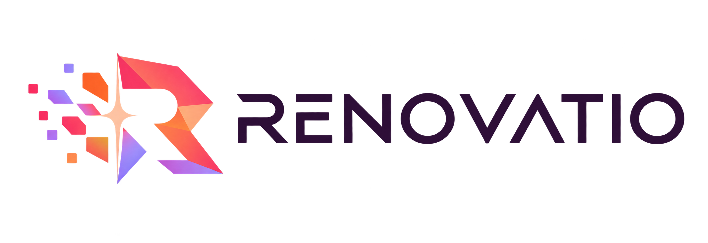

# RENOVATIO — Brand kit

<p align="center">
  
</p>

Visual identity built on the move from a fragmented state toward a consolidated,
modern, governable system. Renovatio is a **modern-ash** project — keep the
company wordmark small and secondary wherever it appears
([github.com/Modern-Ash](https://github.com/Modern-Ash)).

## Files

All assets live in `docs/assets/`.

| File | Description |
| --- | --- |
| `renovatio-logo.png` | Horizontal logo (wordmark + isotype), transparent background — default for light surfaces. |
| `renovatio-logo-dark.png` | Horizontal logo tuned for dark surfaces, transparent background. |
| `renovatio-icon-master.png` | Square master isotype, transparent background — source for favicons and app icons. |
| `renovatio-banner.png` | Landscape 3:1 banner with a central safe zone and the "Engineering the transition" tagline. |

## Palette

| Use | Color | Hex |
| --- | --- | --- |
| Primary | Raspberry | `#F43F7F` |
| Transition | Coral | `#FF6B5F` |
| Energy | Tangerine | `#FF8A3D` |
| Evolution | Lavender | `#A78BFA` |
| Text | Deep plum | `#2D163B` |
| Highlight | Pale peach | `#FFD0B5` |

## Use in Markdown

```md

```

Cover / hero:

```md

```

Dark background (e.g. GitHub dark READMEs):

```md

```

## Use in HTML

Generate `favicon.ico` and the PNG icon set from `renovatio-icon-master.png`, then:

```html
<link rel="icon" href="/favicon.ico" sizes="any">
<link rel="icon" type="image/png" sizes="32x32" href="/favicon-32.png">
<link rel="apple-touch-icon" href="/renovatio-icon-192.png">
```

## Visual criteria

The fragments represent the prior state; the central flare marks the change; the
consolidated `R` represents the new system. Keep clear space around the logo at
least equal to the height of the `R` in the wordmark. When co-branding, the
`modern-ash` wordmark sits at roughly half the height of the Renovatio wordmark
and never competes with it for emphasis.
