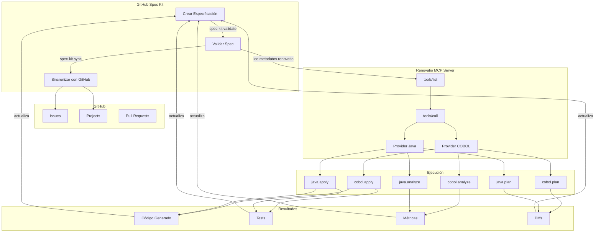
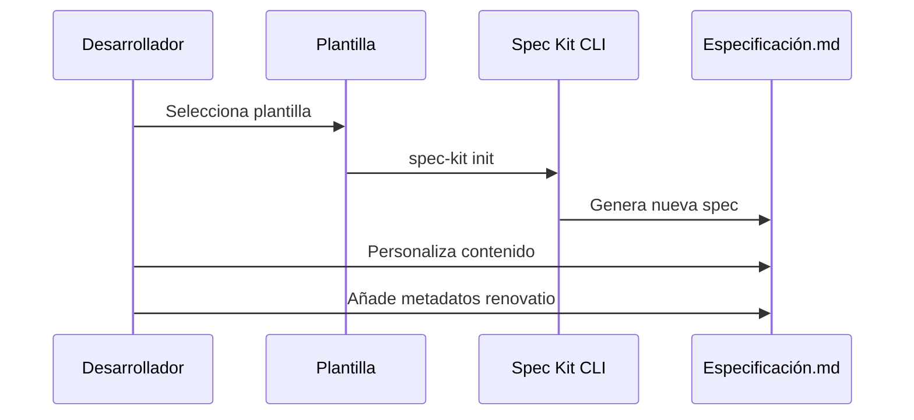
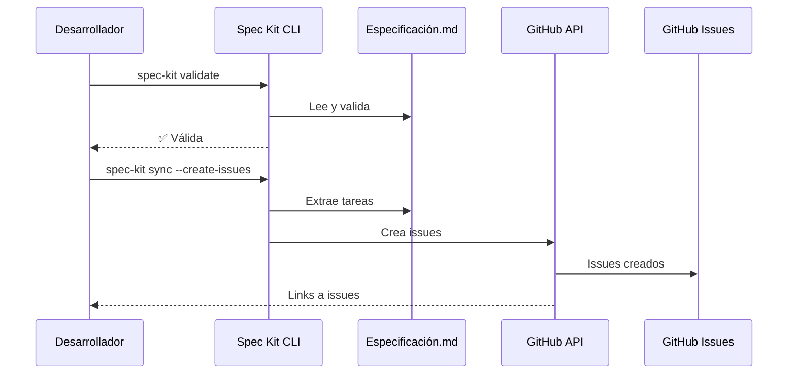
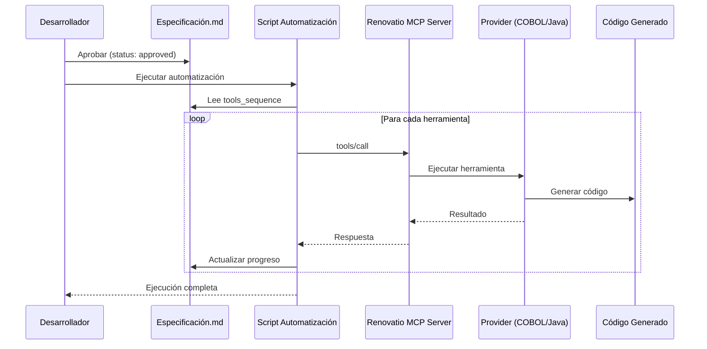
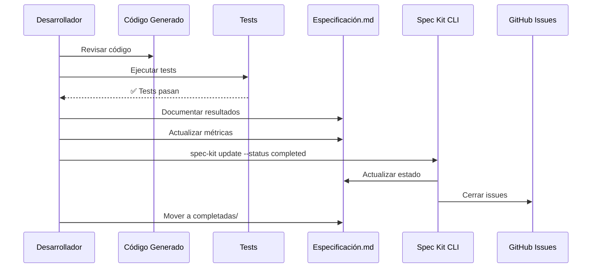

# Integración Spec Kit + Renovatio - Diagrama de Flujo

## Visión General de la Integración



---

## Flujo de Trabajo Detallado

### 1. Creación de Especificación



### 2. Validación y Sincronización



### 3. Ejecución con Renovatio



### 4. Validación y Cierre



---

## Integración de Metadatos

### Metadatos Spec Kit + Renovatio

```yaml
---
# Metadatos estándar Spec Kit
title: "Migración COBOL a Java"
status: "approved"
version: "1.0.0"
author: "equipo-dev"
reviewers: ["arquitecto", "tech-lead"]

# Metadatos específicos de Renovatio
renovatio:
  source_language: "cobol"
  target_language: "java"
  
  # Secuencia de herramientas MCP
  tools_sequence:
    - name: "cobol.analyze"
      params:
        workspacePath: "/workspace/cobol"
      expected_output:
        programs_found: ">= 10"
        
    - name: "cobol.plan"
      params:
        workspacePath: "/workspace/cobol"
        targetLanguage: "java"
      expected_output:
        plan_id: "plan-*"
        
    - name: "cobol.apply"
      params:
        planId: "${PLAN_ID}"  # Del paso anterior
        dryRun: false
      expected_output:
        files_generated: ">= 10"
        
  # Resultados esperados
  expected_outcomes:
    success_rate: ">= 95%"
    compilation_errors: 0
    test_coverage: ">= 70%"
---
```

---

## Automatización Completa

### Script de Ejecución Automática

```bash
#!/bin/bash
# execute-spec-with-renovatio.sh

SPEC_FILE=$1
MCP_SERVER="http://localhost:8081/mcp"

# 1. Validar especificación
echo "Validando especificación..."
spec-kit validate "$SPEC_FILE" || exit 1

# 2. Extraer metadatos renovatio (usando yq o similar)
echo "Extrayendo secuencia de herramientas..."
TOOLS_SEQUENCE=$(yq eval '.renovatio.tools_sequence' "$SPEC_FILE" -o json)

# 3. Ejecutar cada herramienta
echo "$TOOLS_SEQUENCE" | jq -c '.[]' | while read -r tool; do
    TOOL_NAME=$(echo "$tool" | jq -r '.name')
    TOOL_PARAMS=$(echo "$tool" | jq -c '.params')
    
    echo "Ejecutando $TOOL_NAME..."
    
    # Llamada MCP
    RESULT=$(curl -s -X POST "$MCP_SERVER" \
        -H "Content-Type: application/json" \
        -d "{
            \"jsonrpc\": \"2.0\",
            \"id\": \"$(uuidgen)\",
            \"method\": \"tools/call\",
            \"params\": {
                \"name\": \"$TOOL_NAME\",
                \"arguments\": $TOOL_PARAMS
            }
        }")
    
    # Verificar resultado
    if echo "$RESULT" | jq -e '.error' > /dev/null; then
        echo "❌ Error en $TOOL_NAME"
        echo "$RESULT" | jq '.error'
        exit 1
    fi
    
    echo "✅ $TOOL_NAME completado"
    
    # Guardar salida para siguiente herramienta (ej: PLAN_ID)
    if [ "$TOOL_NAME" == "cobol.plan" ]; then
        export PLAN_ID=$(echo "$RESULT" | jq -r '.result.planId')
        echo "Plan ID: $PLAN_ID"
    fi
done

# 4. Actualizar estado de la spec
echo "Actualizando estado de la especificación..."
spec-kit update --status completed "$SPEC_FILE"

echo "✅ Ejecución completa"
```

---

## Arquitectura de Integración

```
┌─────────────────────────────────────────────────────┐
│                 GitHub Spec Kit                      │
│  ┌──────────────┐  ┌──────────────┐  ┌───────────┐ │
│  │ Templates    │  │ CLI Tools    │  │ Metadata  │ │
│  └──────────────┘  └──────────────┘  └───────────┘ │
└────────────────────┬────────────────────────────────┘
                     │ specs/*.md
                     │ + renovatio metadata
                     ▼
┌─────────────────────────────────────────────────────┐
│            Automation Layer (Scripts)                │
│  ┌──────────────┐  ┌──────────────┐  ┌───────────┐ │
│  │ Parser       │  │ Orchestrator │  │ Reporter  │ │
│  └──────────────┘  └──────────────┘  └───────────┘ │
└────────────────────┬────────────────────────────────┘
                     │ JSON-RPC 2.0
                     ▼
┌─────────────────────────────────────────────────────┐
│              Renovatio MCP Server                    │
│  ┌──────────────┐  ┌──────────────┐  ┌───────────┐ │
│  │ Protocol     │  │ Tool Router  │  │ Providers │ │
│  └──────────────┘  └──────────────┘  └───────────┘ │
└────────────────────┬────────────────────────────────┘
                     │
          ┌──────────┴──────────┐
          ▼                     ▼
┌──────────────────┐  ┌──────────────────┐
│ COBOL Provider   │  │ Java Provider    │
│                  │  │                  │
│ • analyze        │  │ • analyze        │
│ • plan           │  │ • plan           │
│ • apply          │  │ • apply          │
│ • metrics        │  │ • format         │
└──────────────────┘  └──────────────────┘
          │                     │
          └──────────┬──────────┘
                     ▼
          ┌──────────────────────┐
          │   Generated Code     │
          │   + Tests + Docs     │
          └──────────────────────┘
```

---

## Beneficios de la Integración

### 1. Trazabilidad Completa
```
Spec → Issues → Code → Tests → Metrics → Spec
```

### 2. Automatización
```
Manual Process: 2-3 días
Con Spec Kit + Renovatio: 2-3 horas
```

### 3. Reutilización
```
1 spec exitosa → plantilla → N proyectos similares
```

### 4. Calidad
```
Validación automática + Tests + Métricas = Alta calidad
```

---

## Próximos Pasos

1. **Fase 1**: Usar specs manualmente con Renovatio
2. **Fase 2**: Crear scripts de automatización básicos
3. **Fase 3**: Integración GitHub Actions
4. **Fase 4**: Dashboard y métricas en tiempo real

---

**Recursos:**
- [EXPLICACION-SPEC-KIT.md](./EXPLICACION-SPEC-KIT.md) - Explicación completa
- [SPEC-KIT-QUICK-START.md](./SPEC-KIT-QUICK-START.md) - Guía rápida
- [specs/INDEX.md](./specs/INDEX.md) - Índice de especificaciones
