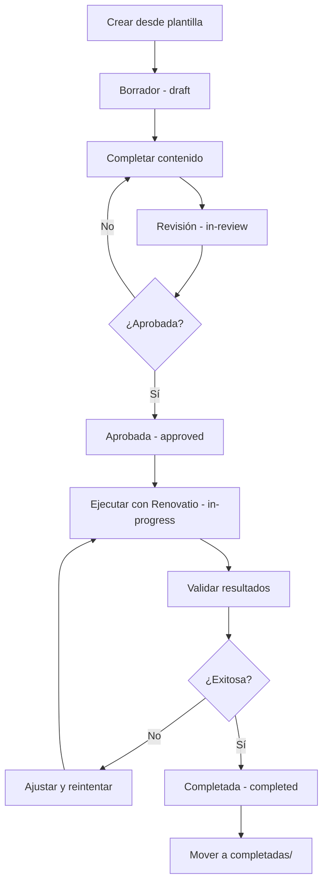

# Índice de Especificaciones Renovatio

> **Centro de documentación para especificaciones técnicas usando GitHub Spec Kit**

---

## 📚 Guías y Documentación

### Para empezar

1. **[SPEC-KIT-QUICK-START.md](../SPEC-KIT-QUICK-START.md)** ⚡
   - Guía rápida para comenzar en 5 minutos
   - Comandos esenciales
   - Ejemplo completo paso a paso

2. **[EXPLICACION-SPEC-KIT.md](../EXPLICACION-SPEC-KIT.md)** 📖
   - ¿Qué es @github/spec-kit?
   - Características principales
   - Cómo puede mejorar Renovatio
   - Propuestas de mejora concretas
   - Plan de implementación

3. **[spec-kit-integracion.md](../spec-kit-integracion.md)** 🔧
   - Guía detallada de integración
   - Flujo de trabajo sugerido
   - Buenas prácticas
   - Integración con MCP

---

## 📝 Plantillas

### Plantilla base

- **[renovatio-spec-template.md](./renovatio-spec-template.md)**
  - Plantilla genérica para cualquier tipo de especificación
  - Estructura completa con todas las secciones
  - Compatible con Spec Kit CLI

### Cómo usar las plantillas

```bash
# Copiar plantilla base
cp docs/specs/renovatio-spec-template.md \
   docs/specs/activas/mi-proyecto.md

# O usar Spec Kit CLI
spec-kit init --template docs/specs/renovatio-spec-template.md \
              --output docs/specs/activas/mi-proyecto.md
```

---

## 🎯 Especificaciones de Ejemplo

### Disponibles ahora

| Ejemplo | Descripción | Complejidad | Herramientas MCP |
|---------|-------------|-------------|------------------|
| **[migracion-cobol-basica.md](./ejemplos/migracion-cobol-basica.md)** | Migración COBOL → Java Spring Boot básica, sin DB2/CICS | Básica | `cobol.analyze`, `cobol.metrics`, `cobol.plan`, `cobol.apply` |

### Ver todos los ejemplos

**[📁 ejemplos/README.md](./ejemplos/README.md)** - Índice completo de especificaciones de ejemplo

---

## 🗂️ Organización de Especificaciones

### Estructura recomendada

```
docs/specs/
├── INDEX.md                          # Este archivo
├── renovatio-spec-template.md        # Plantilla base
│
├── ejemplos/                          # Especificaciones de ejemplo
│   ├── README.md                     # Índice de ejemplos
│   ├── migracion-cobol-basica.md     # Ejemplo: COBOL → Java
│   └── ...                           # Más ejemplos
│
├── activas/                           # Specs en progreso
│   ├── proyecto-1.md
│   ├── proyecto-2.md
│   └── ...
│
└── completadas/                       # Specs finalizadas
    ├── 2025-01-migracion-x.md
    ├── 2025-02-upgrade-y.md
    └── ...
```

### Estados de las especificaciones

| Estado | Ubicación | Descripción |
|--------|-----------|-------------|
| `draft` | `activas/` | Borrador inicial, en desarrollo |
| `in-review` | `activas/` | En revisión técnica |
| `approved` | `activas/` | Aprobada, lista para ejecución |
| `in-progress` | `activas/` | En ejecución activa |
| `completed` | `completadas/` | Finalizada y validada |
| `on-hold` | `activas/` | Pausada temporalmente |
| `cancelled` | `completadas/` | Cancelada, con documentación de razones |

---

## 🚀 Flujo de Trabajo

### Ciclo de vida de una especificación



### Comandos principales

```bash
# 1. Crear nueva spec
cp docs/specs/ejemplos/migracion-cobol-basica.md \
   docs/specs/activas/mi-migracion.md

# 2. Editar y personalizar
vim docs/specs/activas/mi-migracion.md

# 3. Validar
spec-kit validate docs/specs/activas/mi-migracion.md

# 4. Sincronizar con GitHub
spec-kit sync --create-issues docs/specs/activas/mi-migracion.md

# 5. Actualizar estado
spec-kit update --status in-progress docs/specs/activas/mi-migracion.md

# 6. Completar y archivar
spec-kit update --status completed docs/specs/activas/mi-migracion.md
mv docs/specs/activas/mi-migracion.md docs/specs/completadas/
```

---

## 📊 Dashboard de Especificaciones

### Especificaciones activas

Actualmente no hay especificaciones en progreso. ¡Crea la primera!

```bash
cp docs/specs/ejemplos/migracion-cobol-basica.md \
   docs/specs/activas/primera-migracion.md
```

### Especificaciones completadas

Aún no hay especificaciones completadas. Las especificaciones exitosas se archivarán aquí.

---

## 🎓 Recursos de Aprendizaje

### Documentación de Renovatio

- **[README.md](../../README.md)** - Documentación principal del proyecto
- **[ARCHITECTURE.md](../../ARCHITECTURE.md)** - Arquitectura del sistema
- **[MCP-CLIENT-GUIDE.md](../../MCP-CLIENT-GUIDE.md)** - Guía de clientes MCP
- **[MCP-QUICK-REFERENCE.md](../../MCP-QUICK-REFERENCE.md)** - Referencia rápida MCP

### Documentación externa

- **[GitHub Spec Kit](https://github.com/github/spec-kit)** - Repositorio oficial
- **[Model Content Protocol](https://modelcontextprotocol.io/)** - Especificación MCP
- **[OpenRewrite](https://docs.openrewrite.org/)** - Documentación OpenRewrite

---

## 🤝 Contribuir

### Crear una nueva especificación de ejemplo

Si tienes una especificación exitosa que puede ayudar a otros:

1. Copia tu spec desde `activas/` o `completadas/`
2. Colócala en `ejemplos/`
3. Anonimiza información sensible
4. Actualiza el README de ejemplos
5. Crea un Pull Request

### Mejorar las plantillas

Las mejoras a las plantillas son bienvenidas:

1. Edita `renovatio-spec-template.md`
2. Documenta los cambios
3. Actualiza ejemplos si es necesario
4. Crea un Pull Request

---

## 💡 Mejores Prácticas

### Al crear especificaciones

✅ **Usar plantillas existentes** como punto de partida
✅ **Incluir metadatos completos** (título, autor, estado, labels)
✅ **Definir métricas claras** de éxito
✅ **Documentar riesgos** y estrategias de mitigación
✅ **Especificar herramientas MCP** a utilizar
✅ **Mantener actualizada** durante la ejecución

❌ **No incluir información sensible** (credenciales, datos privados)
❌ **No crear specs demasiado amplias** (dividir en múltiples specs)
❌ **No olvidar validar** antes de compartir
❌ **No dejar specs huérfanas** (sin seguimiento)

### Al ejecutar especificaciones

✅ **Seguir el plan definido** en la spec
✅ **Documentar desviaciones** del plan original
✅ **Actualizar el estado** regularmente
✅ **Compartir resultados** con stakeholders
✅ **Archivar al completar** con lecciones aprendidas

---

## 🔍 Búsqueda y Filtrado

### Por lenguaje

```bash
# Especificaciones COBOL
grep -l "source_language: \"cobol\"" docs/specs/**/*.md

# Especificaciones Java
grep -l "source_language: \"java\"" docs/specs/**/*.md
```

### Por estado

```bash
# En progreso
grep -l "status: \"in-progress\"" docs/specs/activas/*.md

# Completadas
ls docs/specs/completadas/
```

### Por herramientas MCP

```bash
# Que usen cobol.analyze
grep -l "cobol.analyze" docs/specs/**/*.md

# Que usen java.plan
grep -l "java.plan" docs/specs/**/*.md
```

---

## 📞 Soporte

### ¿Tienes preguntas?

- **📖 Lee primero**: [SPEC-KIT-QUICK-START.md](../SPEC-KIT-QUICK-START.md)
- **💬 Issues**: [GitHub Issues](https://github.com/accentureshark/renovatio/issues)
- **📧 Contacto**: Consulta el README principal para contactos del equipo

### ¿Encontraste un problema?

Abre un issue describiendo:
- Qué intentabas hacer
- Qué esperabas que pasara
- Qué pasó realmente
- Pasos para reproducir

---

## 🎯 Próximos Pasos

### Si eres nuevo

1. Lee [SPEC-KIT-QUICK-START.md](../SPEC-KIT-QUICK-START.md)
2. Explora [ejemplos/](./ejemplos/)
3. Crea tu primera spec desde un ejemplo
4. Experimenta con Spec Kit CLI

### Si ya tienes experiencia

1. Revisa [EXPLICACION-SPEC-KIT.md](../EXPLICACION-SPEC-KIT.md) para mejoras avanzadas
2. Considera contribuir con nuevos ejemplos
3. Ayuda a mejorar las plantillas
4. Comparte feedback y sugerencias

---

**Última actualización**: 2025-01-15  
**Versión del índice**: 1.0.0
